## All items
 

### All Smelting recipes
1.legendary Ore

2.Ruby Ore

3.Omnitrix Ore

4.Speed ore

### All items crafting recipes
### Spawn Eggs

1.Vilgax Spawn Egg 

### Tools
1.Ascalon

2.AXE SLAYER

3.Heatblast Sword

4.Black Diamond Sword

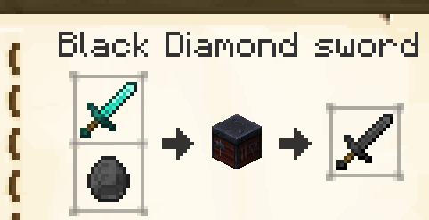

5.Black Diamond Pickaxe

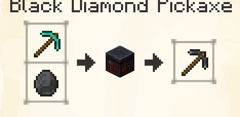

6.Black Diamond Axe

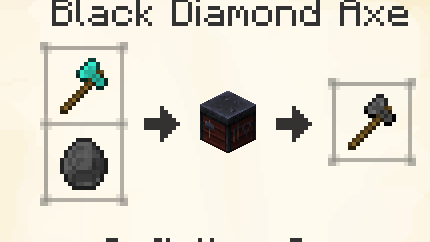

7.Black Diamond Shovel

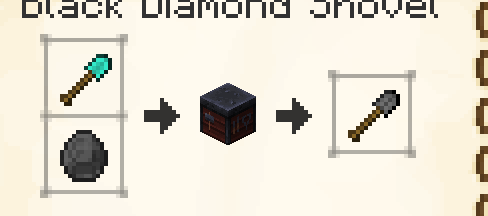

8.Black Diamond Hoe

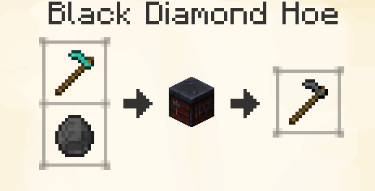

9.Infinitum Sword

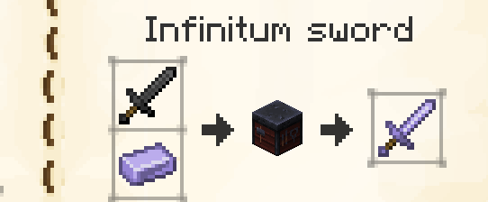

10.Infinitum Pickaxe

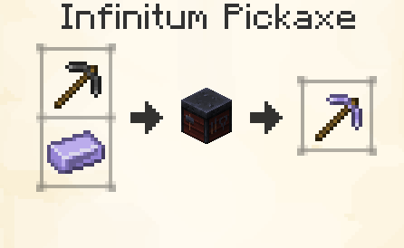

11.Infinitum Axe

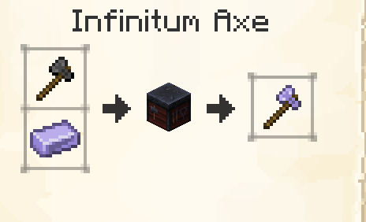

12.Black Diamond Shovel

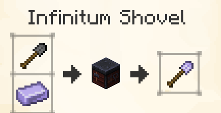

13.Black Diamond Hoe

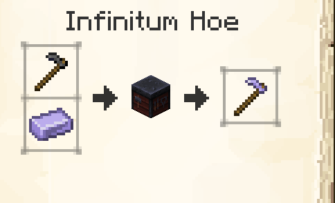

### Armour
1.Knight Helmet

2.Knight Chestplate

3.Knight Leggings

4.Knight boots

5.Heatblast Helmet

6.Heatblast chestplate

7.Heatblast leggings

8.Heatblast boots

9.4Arms Helmet

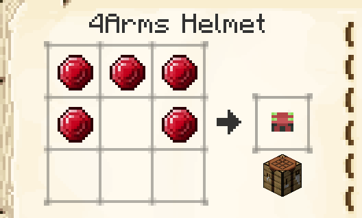

10.4Arms chestplate

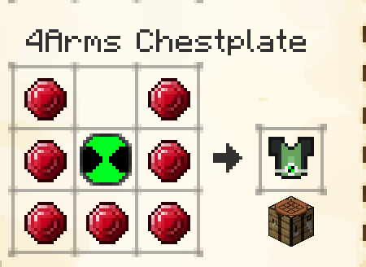

11.4Arms leggings

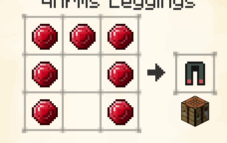

12.4Arms boots

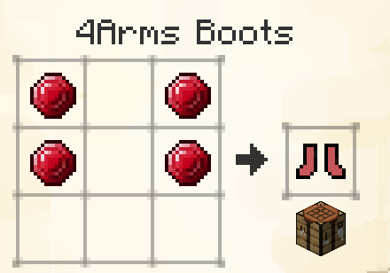

13.Black Diamond Helmet

14.Black Diamond chestplate

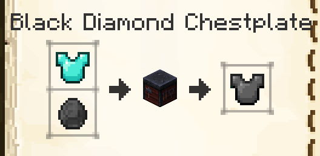

15.Black Diamond leggings

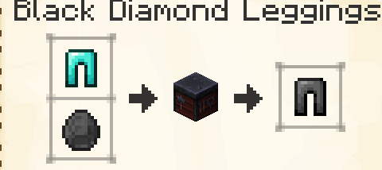

16.4Arms boots

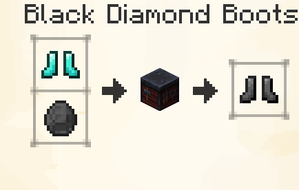

17.Infinitum Helmet

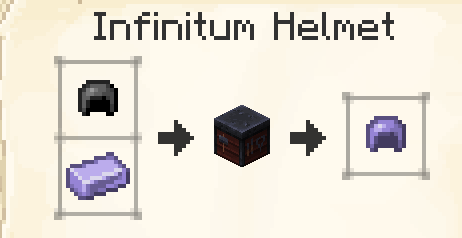

18.Infinitum chestplate

19.Infinitum leggings

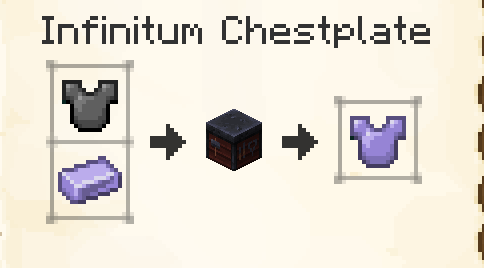

20.Infinitum boots

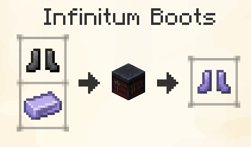

21.jacket

### Food

1.Enchanted Ominitrix Apple

2.Ominitrix Apple

3.Fire Apple

4.Ruby Apple

### Blocks

1.Omnitrix Block

2.Fire Block

3.Legendary Block

4.Ruby Block

5.Speed Block

6.Speed Block

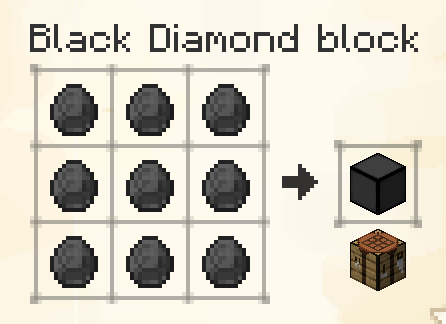

7.Infinitum Block

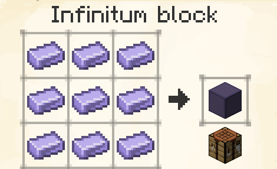

